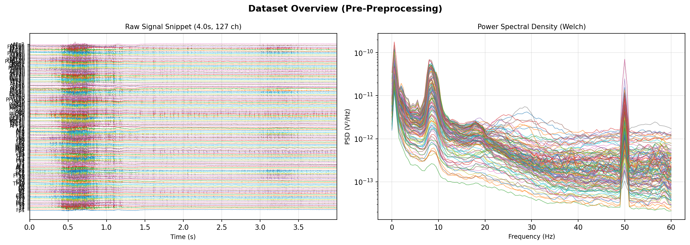

# Supervisor Agent Integration Playground Run Report

## Execution Environment & Overview
- **Model**: `[CONFIGURED: RedHatAI/Ministral-3-14B-Instruct-2512]`
- **Endpoint**: `http://[CONFIGURED - INTERNAL IP/HOST MASKED]`
- **Data Source**: `REAL DATASET`
- **Dataset Path**: `[LOCAL_ROOT]/OneDrive\Desktop\CDAC\eeg_iq_pipeline\eeg_iq_pipeline\ds004796_split\sub-01\sub-01_eyesclosed_raw.fif`
- **Channels**: 127 (1000.0 Hz, Nyquist: 500.0 Hz)
- **Conditions**: `{'Stimulus/S  4': 1, 'Stimulus/S 11': 1}`

## Summary Results Table
| Case | Scenario Name | Routed Node | Status | Trace Events | MLflow Run ID |
|:---|:---|:---|:---:|:---:|:---|
| `playground_test_01` | Case 1: Fully-Specified Query | `gate_1_review` | ✅ **PASS** | 17 | `bea7e1e2d29949eea433af4cb1fd13f3` |
| `playground_test_02` | Case 2: Ambiguous Query (Regional Channels) | `gate_1_review` | ✅ **PASS** | 17 | `6b41441f092d4543afc28589a2d6c978` |
| `playground_test_03` | Case 3: Incomplete Query (Zero-Guessing Guardrail) | `clarification_pause` | ✅ **PASS** | 11 | `c50efb008be643e6b79eff6ff7031dd4` |
| `playground_test_04` | Case 4: Metric-Subset Query (Synthesis Advisory Guardrail) | `gate_1_review` | ✅ **PASS** | 17 | `1822840c421b4bbabec4084e18ef2851` |
| `playground_test_05` | Case 5: Balanced Metric Query (Synthesis Advisory Absent) | `gate_1_review` | ✅ **PASS** | 17 | `8faad65f9f7d49d9b0cbd98f6abe09b8` |
| `playground_test_06` | Case 6: Overview Plot Request + Analysis Plan | `gate_1_review` | ✅ **PASS** | 17 | `17ba81fdaa0a45668baa16c1564c5c56` |

---

## Case 1: Fully-Specified Query
- **Scenario ID**: `playground_test_01`
- **Query**: "compute PLI and coherence for alpha band on Fp1, Fz during Stimulus/S  4"
- **Goal**: Should resolve all parameters with high confidence, generate a complete plan, require no human intervention, and route to gate_1_review.
- **Routed Node**: `gate_1_review`
- **Status**: **PASS** (Real Data: Plan created (2 channels, band=alpha); routed to gate_1_review.)
- **Trace Event Count**: 17
- **MLflow Run ID**: `bea7e1e2d29949eea433af4cb1fd13f3`

### Parameter Manifest
| Parameter | Category | Proposed Value | Confidence | Needs Human Input | Risk Tier |
|:---|:---|:---|:---:|:---:|:---:|
| `freq_band` | scientific_axis | alpha (8.0 - 12.0 Hz) | 1.00 | No | low |
| `channels` | scientific_axis | Fp1, Fz | 1.00 | No | low |
| `condition` | scientific_axis | Stimulus/S  4 | 1.00 | No | low |
| `metrics` | metric_selection | pli, coh | — | No | low |
| `trial_adequacy` | advisory | Only 1 trial(s) available for condition 'Stimulus/S  4'. Connectivity estimates from very few trials have limited statistical reliability. | — | ⚠️ **YES** | **ELEVATED** |
| `reference` | engineering_threshold | average | — | No | **ELEVATED** |
| `tau_phase` | engineering_threshold | 0.2 | — | No | **ELEVATED** |
| `tau_zerolag` | engineering_threshold | 0.35 | — | No | **ELEVATED** |
| `dataset_overview_plot` | informational | generate_dataset_overview_plot available (optional pre-preprocessing diagnostic) | — | No | low |
| `bad_channel_screening` | informational | Not yet performed. Will run in Data Preparation with before/after variance audit. | — | No | low |

### Dataset Overview Plot
*plot tool not invoked for this query*

---

## Case 2: Ambiguous Query (Regional Channels)
- **Scenario ID**: `playground_test_02`
- **Query**: "compute PLI and coherence for alpha band on frontal channels during Stimulus/S  4"
- **Goal**: Should resolve band, condition, and balanced metrics (PLI+Coh), map frontal channels with region confidence (< 0.8), setting needs_human_input=True ONLY on channels row, and route to gate_1_review.
- **Routed Node**: `gate_1_review`
- **Status**: **PASS** (Real Data: Regional query resolved (7 channels mapped, conf=0.7, correctly flagged for review); routed to gate_1_review.)
- **Trace Event Count**: 17
- **MLflow Run ID**: `6b41441f092d4543afc28589a2d6c978`

### Parameter Manifest
| Parameter | Category | Proposed Value | Confidence | Needs Human Input | Risk Tier |
|:---|:---|:---|:---:|:---:|:---:|
| `freq_band` | scientific_axis | alpha (8.0 - 12.0 Hz) | 1.00 | No | low |
| `channels` | scientific_axis | Fp1, Fp2, F3, F4, F7, F8, Fz | 0.70 | ⚠️ **YES** | low |
| `condition` | scientific_axis | Stimulus/S  4 | 1.00 | No | low |
| `metrics` | metric_selection | pli, coh | — | No | low |
| `trial_adequacy` | advisory | Only 1 trial(s) available for condition 'Stimulus/S  4'. Connectivity estimates from very few trials have limited statistical reliability. | — | ⚠️ **YES** | **ELEVATED** |
| `reference` | engineering_threshold | average | — | No | **ELEVATED** |
| `tau_phase` | engineering_threshold | 0.2 | — | No | **ELEVATED** |
| `tau_zerolag` | engineering_threshold | 0.35 | — | No | **ELEVATED** |
| `dataset_overview_plot` | informational | generate_dataset_overview_plot available (optional pre-preprocessing diagnostic) | — | No | low |
| `bad_channel_screening` | informational | Not yet performed. Will run in Data Preparation with before/after variance audit. | — | No | low |

### Dataset Overview Plot
*plot tool not invoked for this query*

---

## Case 3: Incomplete Query (Zero-Guessing Guardrail)
- **Scenario ID**: `playground_test_03`
- **Query**: "analyze this EEG"
- **Goal**: Missing condition, channels, and band. Supervisor must halt with clarification_question, plan=None, and route to clarification_pause.
- **Routed Node**: `clarification_pause`
- **Status**: **PASS** (Real Data: Zero-guessing guardrail held — supervisor halted with clarification and routed to clarification_pause.)
- **Trace Event Count**: 11
- **MLflow Run ID**: `c50efb008be643e6b79eff6ff7031dd4`

### Clarification Question Emitted
> ### Analysis Plan Compilation Halted
> 
> **Missing Scientific Axis: Frequency Band**
> The dataset metadata and conditions are resolved, but **no frequency band** was specified in your request. Functional connectivity analysis requires an explicit frequency band (e.g., "alpha," "8-12 Hz," or "beta").
> 
> **Available Next Steps:**
> 1. Specify a frequency band (e.g., "alpha," "theta," or a custom range like "4-8 Hz").
> 2. If you intended to analyze raw signals (broadband), confirm this explicitly.
> 
> **Critical Guardrail Enforcement:**
> I cannot proceed without this axis. Please clarify the frequency band for analysis.
> 
> ---
> **FYI: Dataset Overview**
> - **Sampling Rate:** 1000 Hz (Nyquist: 500 Hz)
> - **Duration:** ~361 seconds
> - **Channels:** 127 (e.g., Fp1, Cz, Pz, O1, O2, and high-density extended montages)
> - **Conditions:** `Stimulus/S 4`, `Stimulus/S 11` (2 trials total)

### Parameter Manifest
*No parameter manifest generated (guardrail halted execution with clarification question).*

### Dataset Overview Plot
*plot tool not invoked for this query*

---

## Case 4: Metric-Subset Query (Synthesis Advisory Guardrail)
- **Scenario ID**: `playground_test_04`
- **Query**: "compute PLI and wPLI for alpha band on Fp1, Fz during Stimulus/S  4"
- **Goal**: Selected metrics contain only Phase-Robust metrics (PLI+wPLI, no Zero-Lag). Must trigger cross_metric_synthesis advisory row (risk_tier='elevated', needs_human_input=True) and route to gate_1_review.
- **Routed Node**: `gate_1_review`
- **Status**: **PASS** (Real Data: Metric-subset plan created; cross_metric_synthesis advisory verified (elevated risk, human review required); routed to gate_1_review.)
- **Trace Event Count**: 17
- **MLflow Run ID**: `1822840c421b4bbabec4084e18ef2851`

### Parameter Manifest
| Parameter | Category | Proposed Value | Confidence | Needs Human Input | Risk Tier |
|:---|:---|:---|:---:|:---:|:---:|
| `freq_band` | scientific_axis | alpha (8.0 - 12.0 Hz) | 1.00 | No | low |
| `channels` | scientific_axis | Fp1, Fz | 1.00 | No | low |
| `condition` | scientific_axis | Stimulus/S  4 | 1.00 | No | low |
| `metrics` | metric_selection | pli, wpli | — | No | low |
| `trial_adequacy` | advisory | Only 1 trial(s) available for condition 'Stimulus/S  4'. Connectivity estimates from very few trials have limited statistical reliability. | — | ⚠️ **YES** | **ELEVATED** |
| `cross_metric_synthesis` | advisory | DISABLED: Requested metrics lack representation from both Phase-Robust (PLI/wPLI/ImCoh) and Zero-Lag (PLV/Coh) groups. 4-category artifact disambiguation will not run. | — | ⚠️ **YES** | **ELEVATED** |
| `reference` | engineering_threshold | average | — | No | **ELEVATED** |
| `tau_phase` | engineering_threshold | 0.2 | — | No | **ELEVATED** |
| `tau_zerolag` | engineering_threshold | 0.35 | — | No | **ELEVATED** |
| `dataset_overview_plot` | informational | generate_dataset_overview_plot available (optional pre-preprocessing diagnostic) | — | No | low |
| `bad_channel_screening` | informational | Not yet performed. Will run in Data Preparation with before/after variance audit. | — | No | low |

### Dataset Overview Plot
*plot tool not invoked for this query*

---

## Case 5: Balanced Metric Query (Synthesis Advisory Absent)
- **Scenario ID**: `playground_test_05`
- **Query**: "compute PLI and coherence for alpha band on Fp1, Fz during Stimulus/S  4"
- **Goal**: Selected metrics contain both Phase-Robust (PLI) and Zero-Lag (Coherence). Must produce a valid plan with cross_metric_synthesis advisory ABSENT, and route to gate_1_review.
- **Routed Node**: `gate_1_review`
- **Status**: **PASS** (Real Data: Balanced metric plan created; cross_metric_synthesis advisory correctly absent; routed to gate_1_review.)
- **Trace Event Count**: 17
- **MLflow Run ID**: `8faad65f9f7d49d9b0cbd98f6abe09b8`

### Parameter Manifest
| Parameter | Category | Proposed Value | Confidence | Needs Human Input | Risk Tier |
|:---|:---|:---|:---:|:---:|:---:|
| `freq_band` | scientific_axis | alpha (8.0 - 12.0 Hz) | 1.00 | No | low |
| `channels` | scientific_axis | Fp1, Fz | 1.00 | No | low |
| `condition` | scientific_axis | Stimulus/S  4 | 1.00 | No | low |
| `metrics` | metric_selection | pli, coh | — | No | low |
| `trial_adequacy` | advisory | Only 1 trial(s) available for condition 'Stimulus/S  4'. Connectivity estimates from very few trials have limited statistical reliability. | — | ⚠️ **YES** | **ELEVATED** |
| `reference` | engineering_threshold | average | — | No | **ELEVATED** |
| `tau_phase` | engineering_threshold | 0.2 | — | No | **ELEVATED** |
| `tau_zerolag` | engineering_threshold | 0.35 | — | No | **ELEVATED** |
| `dataset_overview_plot` | informational | generate_dataset_overview_plot available (optional pre-preprocessing diagnostic) | — | No | low |
| `bad_channel_screening` | informational | Not yet performed. Will run in Data Preparation with before/after variance audit. | — | No | low |

### Dataset Overview Plot
*plot tool not invoked for this query*

---

## Case 6: Overview Plot Request + Analysis Plan
- **Scenario ID**: `playground_test_06`
- **Query**: "show me an overview plot of the dataset, then compute PLI and coherence for alpha band on Fp1, Fz during Stimulus/S  4"
- **Goal**: Explicitly requests dataset overview plot before analysis. Supervisor must organically call generate_dataset_overview_plot via ReAct loop, resolve all parameters, and route to gate_1_review.
- **Routed Node**: `gate_1_review`
- **Status**: **PASS** (Real Data: Overview plot generated (playground_test_06_overview.png exists); plan constructed (2 channels, band=alpha); routed to gate_1_review.)
- **Trace Event Count**: 17
- **MLflow Run ID**: `17ba81fdaa0a45668baa16c1564c5c56`

### Parameter Manifest
| Parameter | Category | Proposed Value | Confidence | Needs Human Input | Risk Tier |
|:---|:---|:---|:---:|:---:|:---:|
| `freq_band` | scientific_axis | alpha (8.0 - 12.0 Hz) | 1.00 | No | low |
| `channels` | scientific_axis | Fp1, Fz | 1.00 | No | low |
| `condition` | scientific_axis | Stimulus/S  4 | 1.00 | No | low |
| `metrics` | metric_selection | pli, coh | — | No | low |
| `trial_adequacy` | advisory | Only 1 trial(s) available for condition 'Stimulus/S  4'. Connectivity estimates from very few trials have limited statistical reliability. | — | ⚠️ **YES** | **ELEVATED** |
| `reference` | engineering_threshold | average | — | No | **ELEVATED** |
| `tau_phase` | engineering_threshold | 0.2 | — | No | **ELEVATED** |
| `tau_zerolag` | engineering_threshold | 0.35 | — | No | **ELEVATED** |
| `dataset_overview_plot` | informational | generate_dataset_overview_plot available (optional pre-preprocessing diagnostic) | — | No | low |
| `bad_channel_screening` | informational | Not yet performed. Will run in Data Preparation with before/after variance audit. | — | No | low |

### Dataset Overview Plot

> **LLM Plot Observation Summary:**
>
> ### Plan Compilation
> The following analysis plan has been compiled based on your request and dataset metadata:
> 
> ---
> **1. Overview Plot**
> - A dataset overview plot has been generated and saved to:
>   `outputs/plots/playground_test_06_overview.png`
>   (Raw signal snippet + PSD for all 127 channels, 361.29s duration, 1000Hz sampling).
> 
> ---
> **2. Functional Connectivity Analysis**
> - **Frequency Band**: Alpha (8–12 Hz)
> - **Channels**: Fp1, Fz
> - **Condition**: Stimulus/S 4
> - **Metrics**: PLI, Coherence
> 
> ---
> **Scientific Axes Validation**
> | Axis          | Resolved Value       | Confidence | Notes                                  |
> |---------------|----------------------|------------|----------------------------------------|
> | Frequency     | Alpha (8–12 Hz)      | High       | Nyquist-compliant, epoch duration sufficient. |
> | Channels      | Fp1, Fz              | High       | Exact matches in dataset.              |
> | Condition     | Stimulus/S 4         | High       | Valid trigger in dataset (1 trial).    |
> 
> ---
> **Next Steps**
> The pipeline is now ready to execute the connectivity analysis. No further confirmation is required. Outputs will be written to:
> `outputs/connectivity/playground_test_06/`
> 
> ---
> **FYI**
> - The dataset contains **2 trials total** (Stimulus/S 4 and Stimulus/S 11). Only Stimulus/S 4 was selected for this analysis.
> - If you later wish to include Stimulus/S 11 or adjust metrics (e.g., add wPLI/ImCoh/PLV), the pipeline can be rerun with updated parameters.

---
